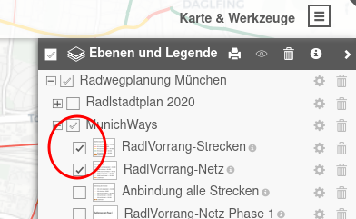
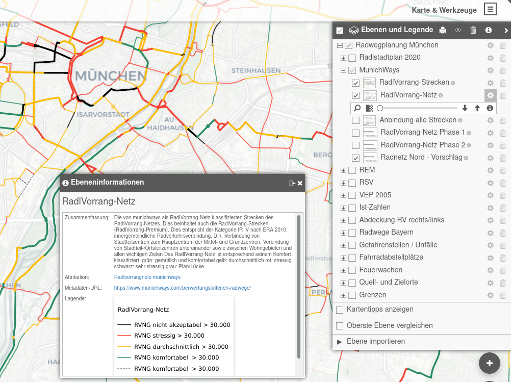
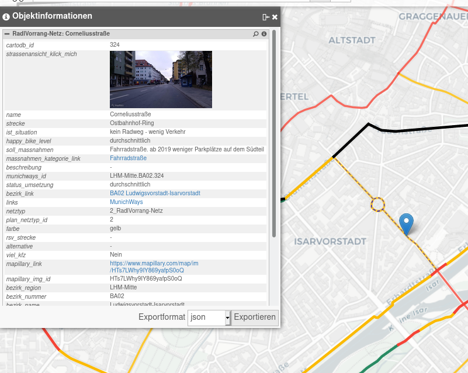
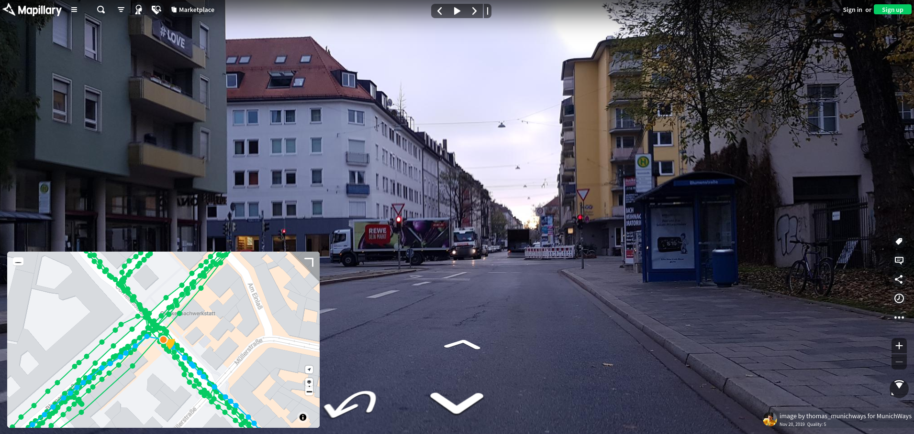
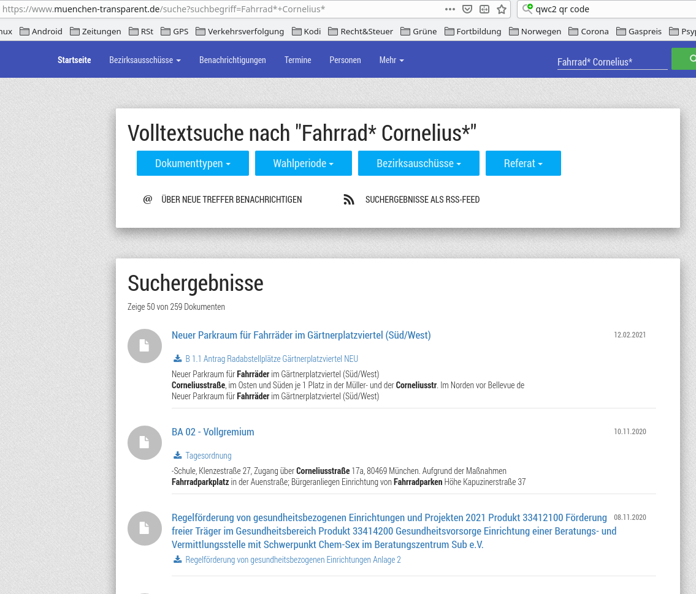

Nutzung
=======

Ebenenauswahl
-------------

Durch Auswahl des Menüsymbols in der rechten Leiste oder über 'Karten und Werkzeuge' rechts oben und dann Auswahl 'Ebenen und Legende' erhält man die Liste der Ebenengruppen. Nach Anklicken des + Symbols erscheinen die einzelnen Ebenen einer Gruppe.

Die einzelnen Ebenen lassen sich wiederum durch Anklicken aktivieren oder deaktivieren, d.h. sichtbar oder unsichtbar machen.

Aktionen für einzelne Ebenen
----------------------------

Bei Auswahl der Zahnradsymbols kann man für jede einzelne Ebene Aktionen starten:

- mit der Lupe diese Ebene auf die Mitte des Bildschirms zentrieren
- mit dem Schieberegler die Transparenz (Durchsichtigkeit) der Ebene einstellen
- durch Klick auf das i Symbol eine ausführliche Erläuterung zu dieser Ebene erhalten
- die Ebene nach oben oder unten schieben, so dass sie über oder unter den anderen Ebenen gezeichnet wird
- die Ebene löschen

Durch Verschieben der Ebenen oder das Löschen der Ebenen kann man sich eine individuelle Karte zusammenstellen. Diese kann man als 'Favorit' im Browser speichern und immer wieder aufrufen, da die Ebenenstruktur in der URL der Website gespeichert wird.

.. Hinweis::

    Da die Website im Moment noch häufiger umgebaut wird, ändert sich die Ebenenstruktur und es ist möglich, dass Ebenen nicht angezeigt werden. Dann muss man wieder mit der ursprünglichen URL *https://radwegplanung-muenchen.de* beginnen.

Detailansichten von Punkten einer Ebene
---------------------------------------

Ist eine Ebene aktiv (sichtbar), kann man mit einem **Links-Mausklick** Detailinformationen zu einem Element der aktiven Ebenen, wie eine kategorisierte Strecke, erhalten. Das nachfolgende Bild zeigt ein Beispiel der von munichways erfassten Daten zur Corneliusstraße:

Es ist möglich, diese Detailinformation sich als .json- oder als .csv-Datei herunterzuladen.

Darstellung von Straßenansichten mit Mapillary
----------------------------------------------

Die von munichways kategorisierten Strecken sind fast alle mit Links auf *Mapillary* mit Straßenansichten aus der Perspektive von Radfahrenden erfasst. Durch Klick auf `Straßenansicht_klick_mich` bzw. das Bild selbst in der Objektinformation wird die Mapillary-Website geöffnet, und man kann virtuell die ausgewählte Straße aus der Fahrradperspektive befahren.

Zugriff auf das Ratsinformationssystem (RIS) der Stadt München
--------------------------------------------------------------

Unabhängig von der aktiven (sichtbaren) Ebene erhält man mit einem **Rechts-Mausklick** auf eine Straße alle Informationen aus dem `Ratsinformationssystem der Stadt München (RIS) <https://www.ris-muenchen.de/RII/RII/ris_startseite.jsp>`_ zu Entscheidungen etc. der Stadtverwaltung zu Fahrradthemen in dieser Straße. Dazu wird eine vorbereitete Anfrage an `muenchen-transparent <https://www.muenchen-transparent.de/>`_ abgesetzt. Die Abbildung zeigt das Ergebnis bei einem Rechts-Mausklick auf die Corneliusstraße.

.. Hinweis::

    Bei der ersten Abfrage fragt der Webbrowser, ob die Website *radwegplanung-muenchen.de* die Website *muenchen-transparent* aufrufen darf. Dies muss einmalig bestätigt werden.

Anzeigen von Informationen beim Überstreichen mit der Maus
----------------------------------------------------------

Manche Ebenen (z.B. Fahrradabstellplätze --> CityWise, konsolidierte Zentren) zeigen Zusatzinformationen, wenn man mit der Maus darüberstreicht (*mouse over*). Bei CityWise sind es Bilder, bei den Zentren wird der Name des Zentrums angezeigt. Dazu muss aber im Menü *Ebenen und Legende* die Auswahl *Kartentipps anzeigen* angeklickt (eingeschaltet) sein.

