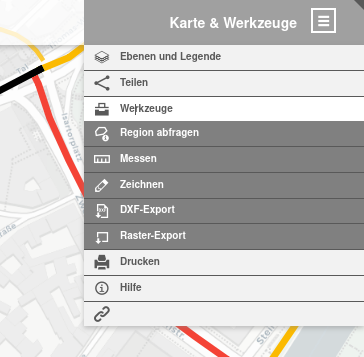
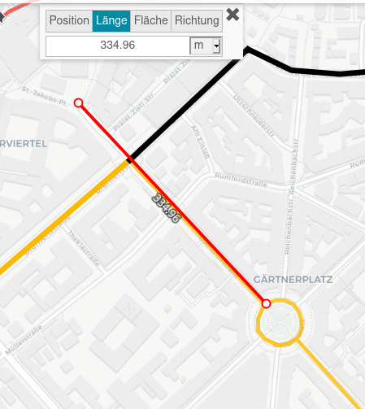
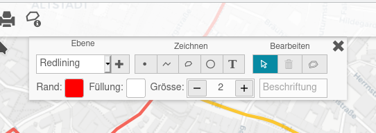
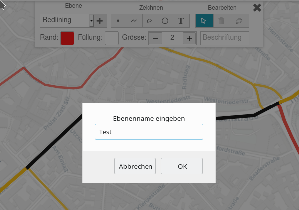
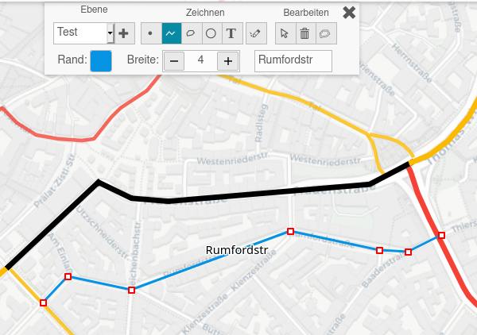
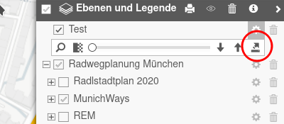
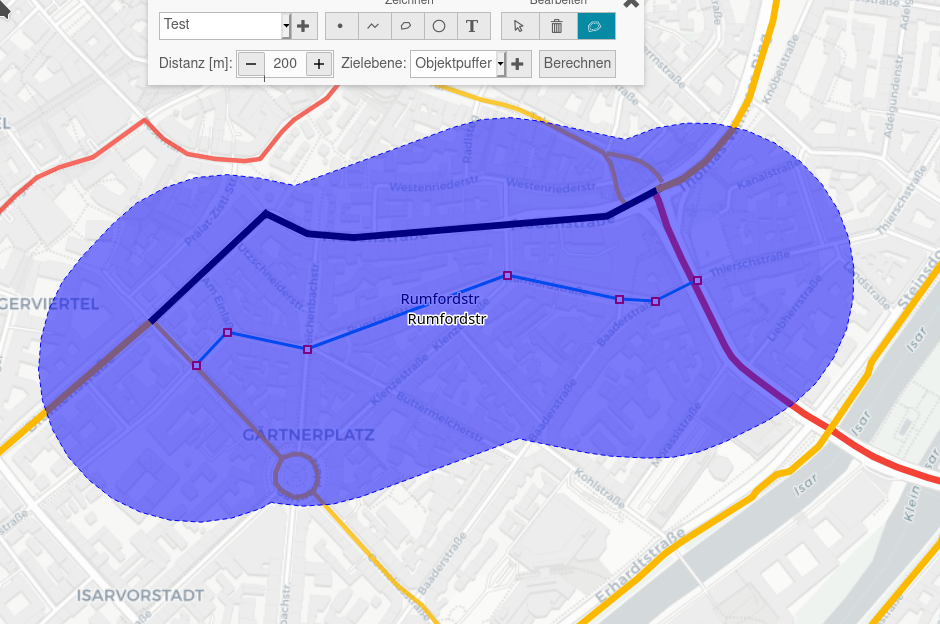

Werkzeuge
=========

Suchen
------

Im Suchschlitz links oben kann eine Straßenadresse eingetragen werden, wie beispielsweise *Corneliusstr München*. Dann wird die Corneliusstraße angezeigt und die Karte darauf zentriert.

Messen
------

Über

gelangt man zur Auswahl von Werkzeugen. Hier kann man beispielsweise die Entfernung zwischen zwei oder mehreren Punkten auf der Karte messen - im Beispiel hier die Entfernung zwischen dem St. Jakobsplatz und dem Gärtnerplatz:

Jeder Punkt auf der Strecke wird mit **einem** Mausklick markiert. Der letzte Punkt wird mit **zwei** Mausklicks quittiert. Zur Abkürzung kann man auch das Messsymbol rechts neben dem Suchschlitz anklicken, um zur Entfernungsmessung zu gelangen.

Analog kann man auch die Größe von Flächen oder die Kompassausrichtung bestimmen.

Die aktuelle Position des Mauszeigers auf der Karte als Koordinate kann auch über das Mess-Menü bestimmt und in die Zwischenablage kopiert werden. Sie wird jedoch auch immer in der Fußzeile angezeigt, jedoch aus Platzgründen nicht auf Mobilgeräten.

Zeichnen
--------

Mit den Zeichenwerkzeugen kann man auf der Karte eigene Ergänzungen hinzufügen, speichern, weitergeben oder später wieder laden. Man erhält das folgende Auswahlmenü:

Die Ergänzungen werden in einer eigenen Ebene gespeichert. Die erste Ebene ist sprechend *Redlining* benannt. Möchte man weitere Ebenen hinzufügen, klickt man auf das + Symbol, und man kann einen neuen Ebenenamen eingeben, hier *Test*.

Jetzt kann man neue Objekte hinzufügen - Punkte, Linien, Polygone, Kreise oder Texte. Diesen gibt man jeweils einen sprechenden Namen. Man kann diesen Objekten im beschränkten Umfang Farben und Dicken zuweisen - wie im Beispiel hier eine neue Strecke durch die Rumfordstraße.

Die neu erzeugte Ebene findet man unter *Karte und Ebenen*. Nach Anklicken des Zahnradsymbols kann man diese Ebene durch Anklicken des kleinen Pfeils nach oben exportieren:

Die \*.json Datei kann man lokal speichern oder weitergeben. Man kann sie später unter *Ebene importieren - lokale Datei* wieder auf der Karte anzeigen.

Es ist möglich, um die neu erzeugten Punkte, Linien, Polygone oder Kreise sich *Puffer* zeichnen zu lassen. Hier ist ein Beispiel eines Puffers von jeweils 200 m rechts und links von der Rumfordstraße.

